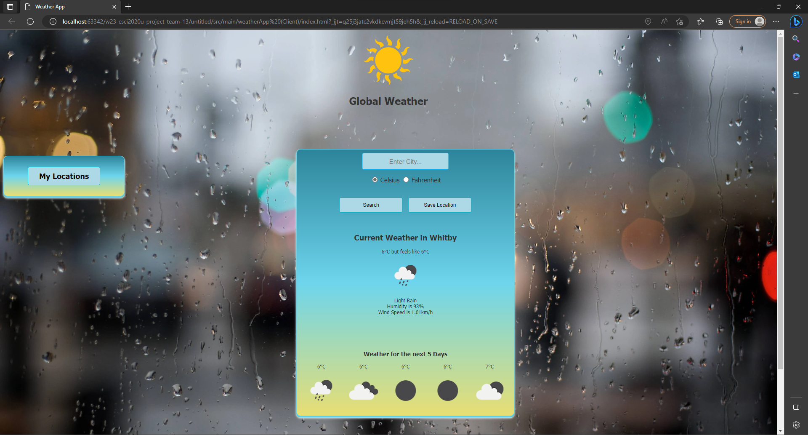
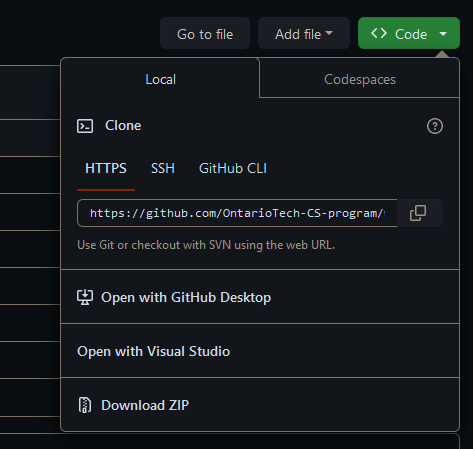
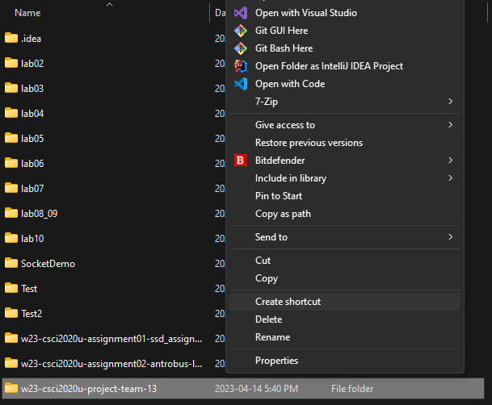
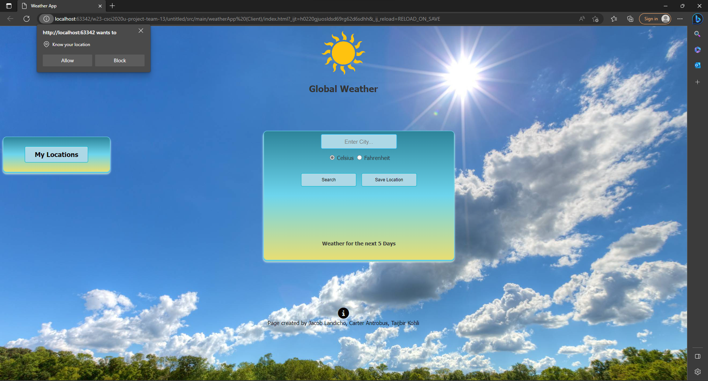
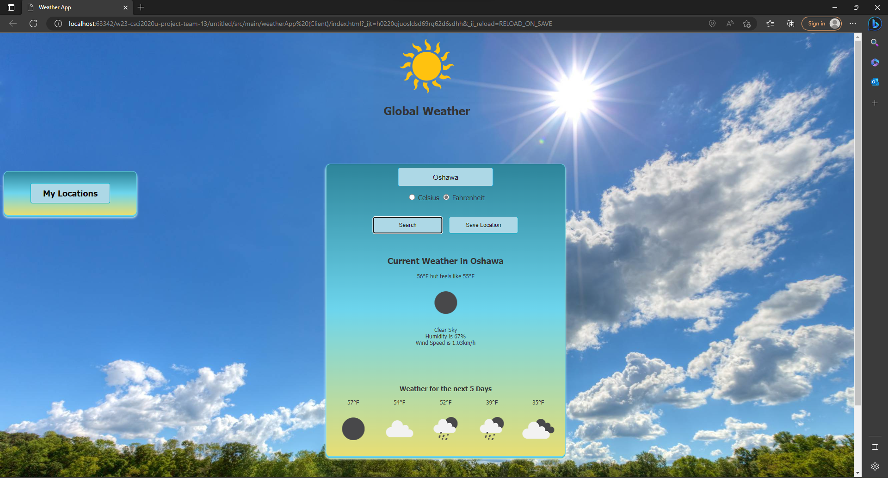
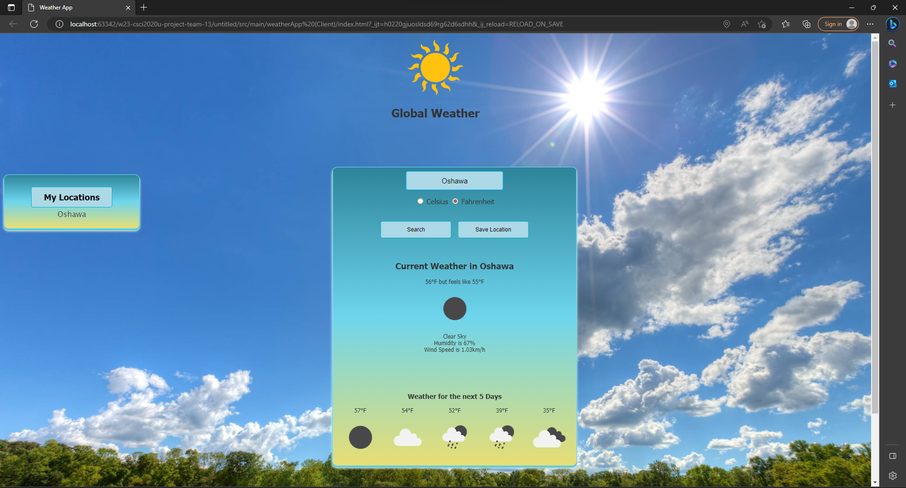
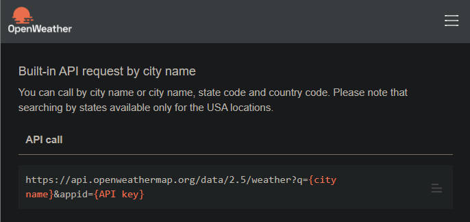
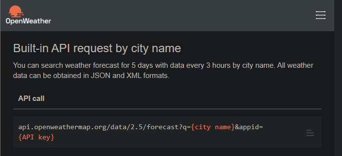

[//]: # ([![Review Assignment Due Date]&#40;https://classroom.github.com/assets/deadline-readme-button-8d59dc4de5201274e310e4c54b9627a8934c3b88527886e3b421487c677d23eb.svg&#41;]&#40;https://classroom.github.com/a/xVkiPLj0&#41;)

[//]: # (# w23-csci2020u-project-team-13)

# Weather Application (Instructions)
<!-- > Course: CSCI 2020U: Software Systems Development and Integration -->

## Table Of Contents
- [Project Information](#Project-Information)
    - [Description](#Description)
    - [Link to Google Drive](#Link-to-Google-Drive)
- [Screenshots](#Screenshots)
  - [Screenshot 1](#Screenshot-1)
  - [Screenshot 2](#Screenshot-2)
- [Java Restful API](#Java-Restful-API)
    - [API Attempt](#API-Attempt)
- [How To Run](#How-To-Run)
- [Other Resources](#Other-Resources)

## Project Information
### Description
This project allows users to ``view weather information`` for a given location.\
``On startup``, the weather app will ask for the ``user's location`` then display the weather information for that location.\
``Information includes`` temperature, feels like temperature, cloud description, humidity, wind speed and the forecasted weather for the next 5 days.\
The user may choose to display the temperatures in ``Fahrenheit or Celsius``.\
The user may also ``enter a city name`` into the search bar and retrieve the weather data for that city. The ``background`` of the website will ``change`` with the weather.\
In addition to this, the user can enter a city name in the search bar and ``save`` it to their ``favourite locations``. These are stored in the cache and will be saved on exit or reload.

### Link to Google Drive
This is a link to a google drive containing the video showing the application functionality:\
https://drive.google.com/drive/folders/18UdRmKQozcwXLxy1rc63EJ2j3v73qWeI?usp=sharing

## Screenshots
### Screenshot 1
A picture showing weather data from user location or searched location.

### Screenshot 2
A picture showing a list of favourite locations.

## Java Restful API
### API Attempt
We have attempted to implement the java restful api.\
The server successfully fetches the weather data from the weather api.\
But, when we tried to do a javascript fetch for that weather data in our server,
there were multiple errors we tried hard to solve but could not figure out.\
So instead we implemented the project fully through javascript, html and css.\
However, the project is still a fully functioning weather application.\
Our attempted java files are included.

## How To Run
These are the instructions to run the code

1. Go to our ``github`` repository: https://github.com/OntarioTech-CS-program/w23-csci2020u-project-team-13 and ``copy`` the project from the ``code`` dropdown, cloning it into the local directory of your choice.\
   
#
2. Load the project folder through ``Intellij`` by left-clicking the project and selecting ``Open Folder as Intellij IDEA Project``\
   
#
3. Select the ``index.html`` file and run the ``current file`` or select one of the ``browser icons`` on the right.\
      
#
4. When the browser loads, select ``allow`` the 'know your location' request. The app will then show ``weather data for your location``.\
   
#
5. You may enter a city name in the ``search bar`` and retrieve the ``weather data`` for that location.
   
#
6. You may change the ``unit to Fahrenheit`` by selecting the Fahrenheit option and selecting ``search again``.
   
# 
7. You may also enter a city name into the search bar and ``save it`` to your ``favorite locations`` by selecting the ``save location button``. These locations will appear in the ``left sidebar`` and will save when you ``exit or reload`` the browser.
   
# 
8. These locations can then be selected ``on the fly`` by hovering over their city names and selecting them.
   

## Other Resources
1. https://openweathermap.org/api \
This was used to retrieve weather data by city name for the current weather and forecasted weather.\
Specifically, https://openweathermap.org/current was used for current weather\
   

and https://openweathermap.org/forecast5 was used for the forecasted weather.\
   

This is an example of the weather data that the api returns. The city in the example is Toronto.\
   \
This data is a json object which was accessed by our team to retrieve weather data.\
NOTE: This api is on a free plan. Therefore, it has a request limit of 1,000,000 requests per month. 

2. https://www.bigdatacloud.com/ \
This was used to retrieve user location given their longitude and latitude.
